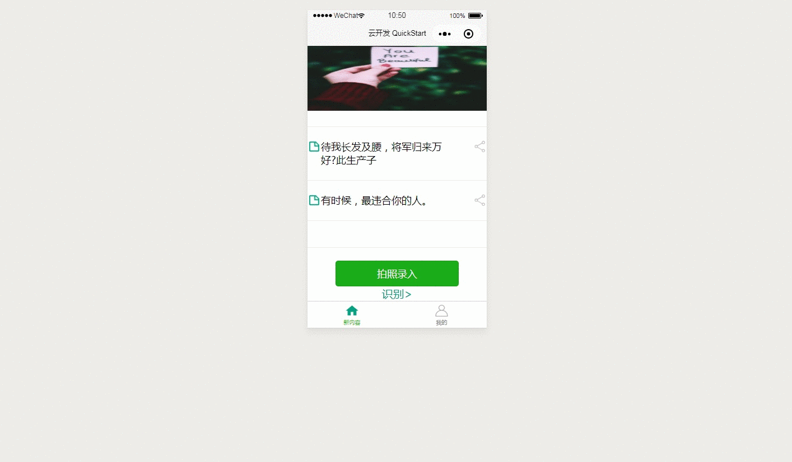
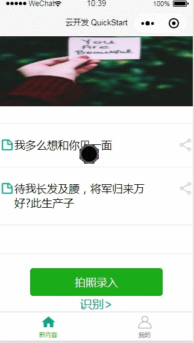

#使用腾讯云手写OCR API的微信小程序
 
>主要功能：识别图片形式的手写笔记并展示
 
     //appid等作为全局变量定义在了app.js里
     //使用时需将相应字段添加到app.js文件中
     globalData: {
     appid: "",
     secretid: "",
     secret: ""
      }
 
###主界面

 
###识别功能

 
###修改存储
